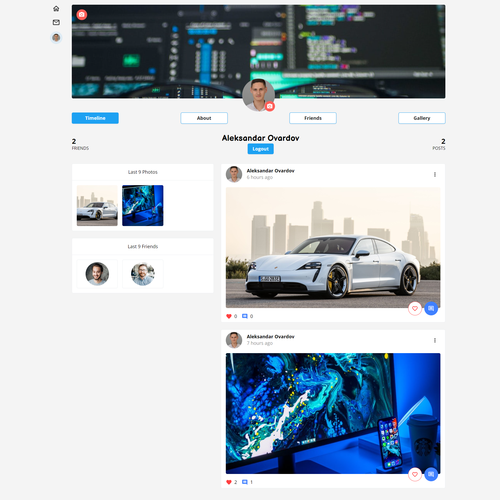
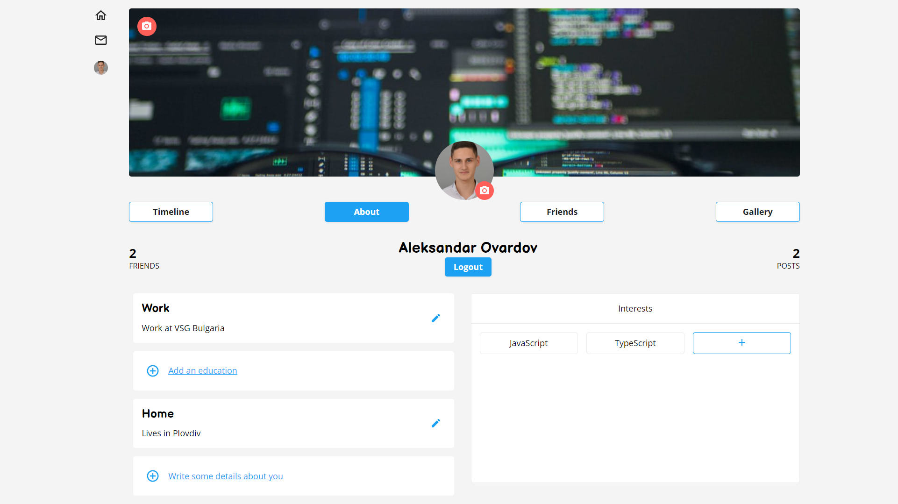
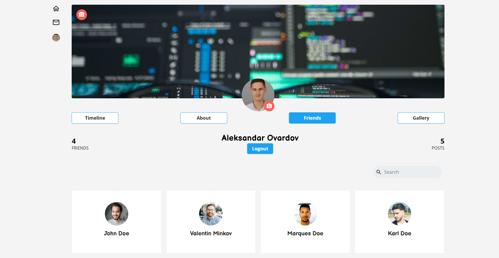
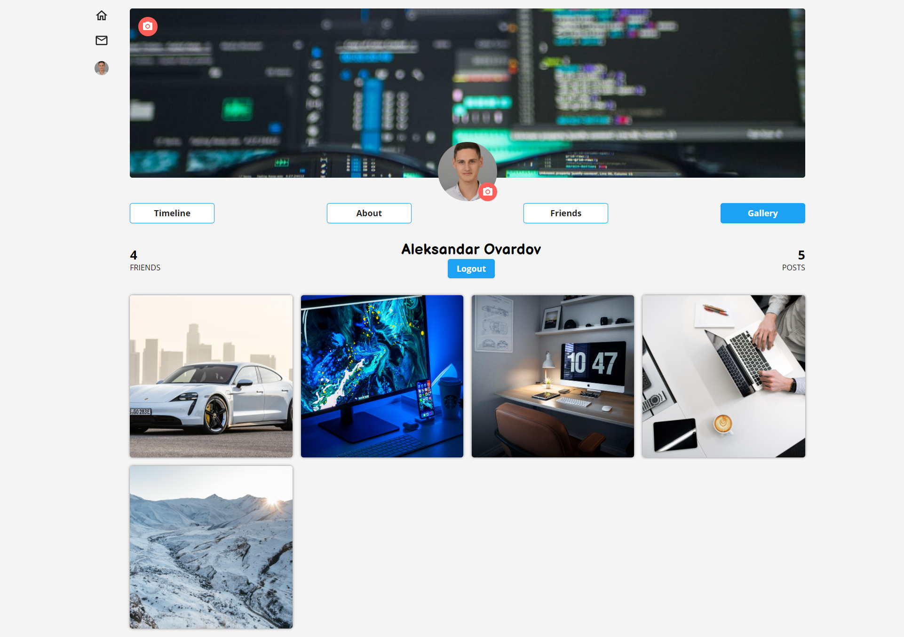
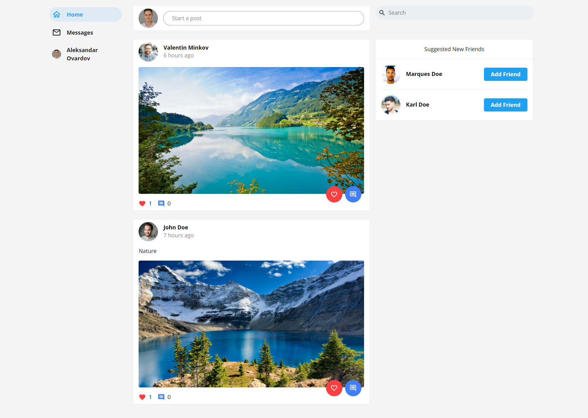
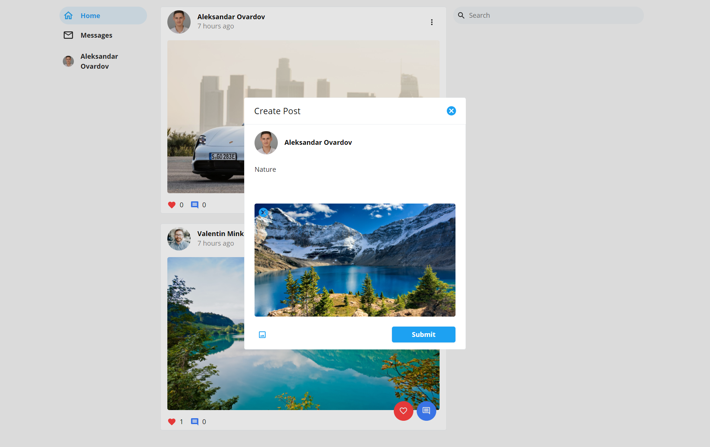
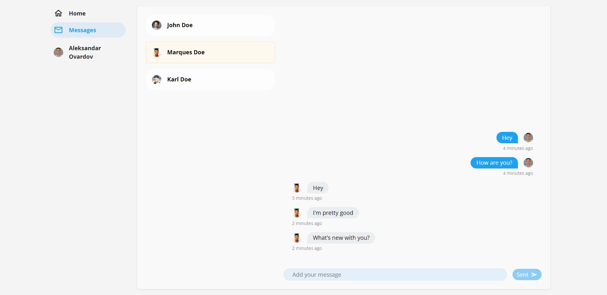
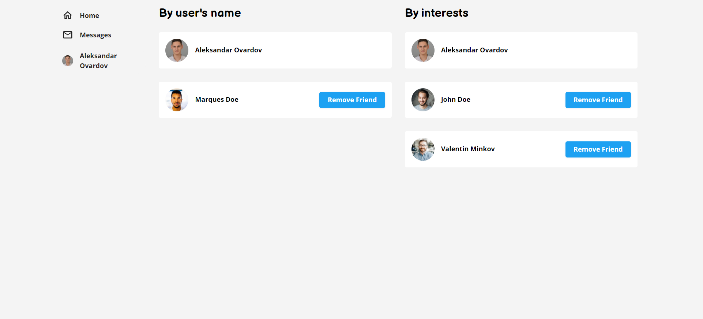

# Social-Network

<table>
  <tbody>
    <tr>
      <td align="center" valign="middle"> 
        
      </td>
      <td align="center" valign="middle"> 
        
      </td>
      <td align="center" valign="middle"> 
        
      </td>
       <td align="center" valign="middle"> 
        
      </td>
    </tr>
    <tr>
      <td align="center" valign="middle"> 
        
      </td>
      <td align="center" valign="middle"> 
        
      </td>
      <td align="center" valign="middle"> 
        
      </td>
      <td align="center" valign="middle"> 
        
      </td>
    </tr>
    <tr>
       <td align="center" valign="middle"> 
        
      </td>
      <td align="center" valign="middle"> 
        
      </td>
      <td align="center" valign="middle"> 
        
      </td>
      <td align="center" valign="middle"> 
        
      </td>
    </tr>
  </tbody>
</table>


## Table of Contents
1. [Application Configurations](https://github.com/Ovardov/Social-Network#application-configurations)
2. [Technology stack](https://github.com/Ovardov/Social-Network#technology-stack)
3. [Routing](https://github.com/Ovardov/Social-Network#routing)

## Application Configurations
1. Rename ".env.example" file to ".env" and fill in necessary information in it.
2. Type in the terminal the following in both Server and Client directory:
```bash
npm install
```
3. Type in the terminal the following in both Server and Client directory:
```bash
npm run dev
```
4. Enjoy it!

## Technology stack
- React.js
- Express.js
- Node.js
- MongoDB
- SASS
- Socket.IO

## List of all functionalities
1. Register
2. Login with Email/Facebook/Google
3. Logout
4. Real-Time chat with friends
5. Add/Edit/Delete/Like/Dislike post
6. Add/Edit/Delete/Like/Dislike comment on post
7. User profile page
8. Add/Change profile picture
9. Add/Change cover picture
10. Add/Edit/Delete user personal information
11. Add/Edit/Delete user interests
12. Search users by their name or by their interests

## Routing
Route | Description
------|------------|
/ | Home Page
/login | Login page
/register | Register page
/messages | Real-Time Chat page
/profile/:username | Profile page
/profile/:username/about | User's personal information
/profile/:username/friends | User's friends
/profile/:username/gallery | User's gallery
/search | Search page
